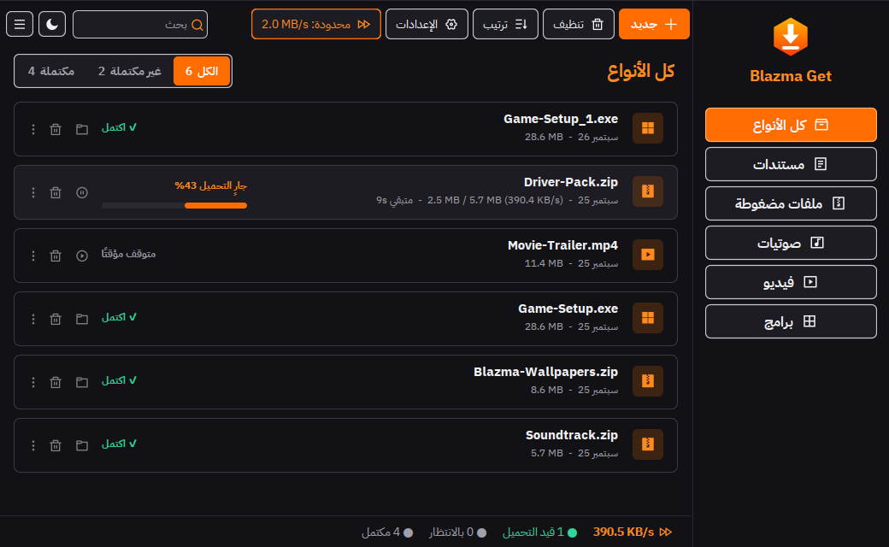
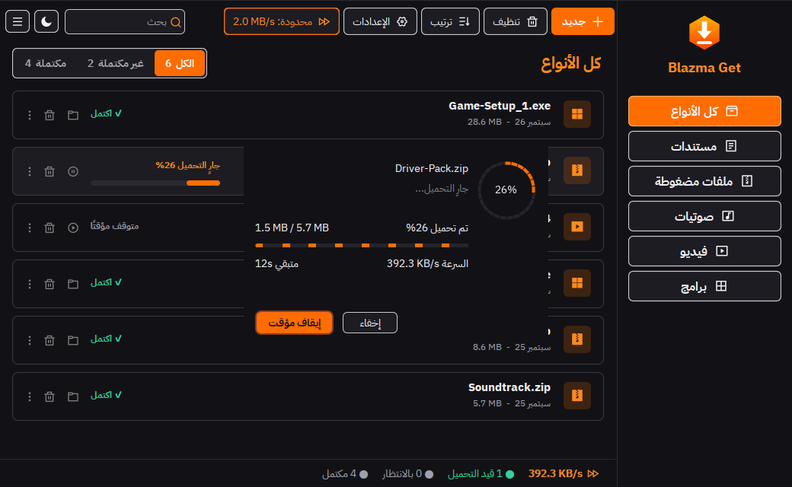
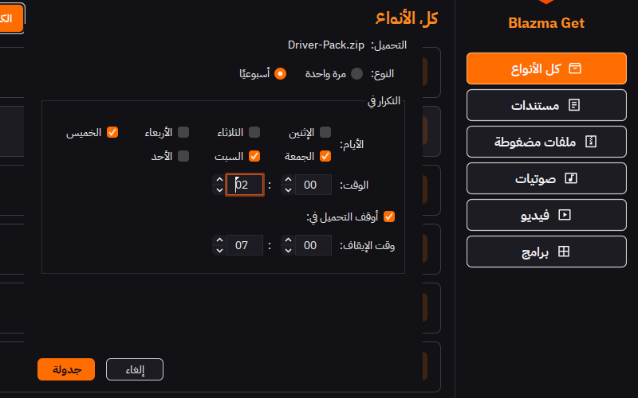
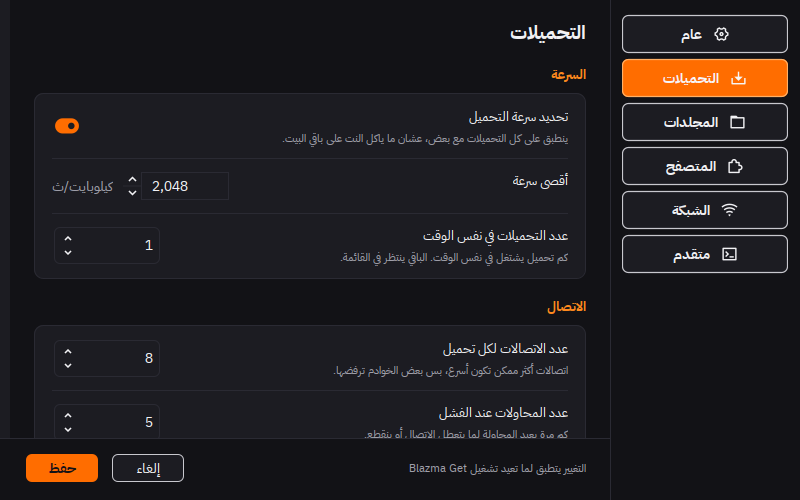
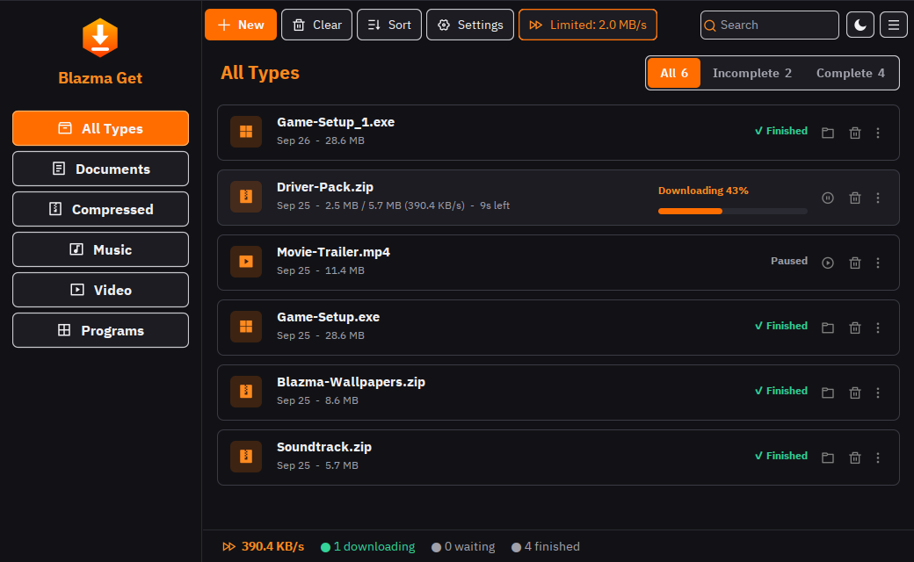
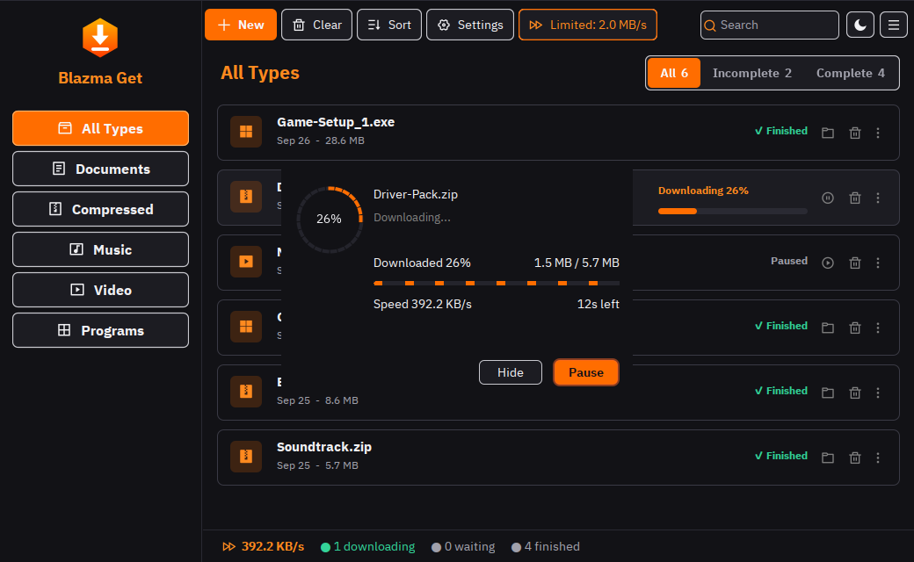

<p align="center">
  
</p>

<h1 align="center">Blazma Get</h1>

<p align="center">
  مدير تحميل مجاني ومفتوح المصدر بواجهة عربية، بديل لـ IDM بدون كراك وبدون فيروسات<br>
  A free, open-source download manager with a native Arabic interface
</p>

<p align="center">
  <a href="https://github.com/mr-kateba/Blazma-Get/releases/latest"></a>
  <a href="https://github.com/mr-kateba/Blazma-Get/actions/workflows/build.yml"></a>
  <a href="LICENSE"></a>
  <a href="https://github.com/mr-kateba/Blazma-Get/releases"></a>
</p>

<p align="center">
  <a href="#العربية">العربية</a> · <a href="#english">English</a>
</p>

---

<div dir="rtl">

## العربية

أغلب الناس يستخدمون IDM مكرك، والكراكات هي أسهل طريق للفيروسات. **Blazma Get** مجاني بالكامل ومفتوح المصدر، وتقدر تشوف كوده بنفسك. واجهته عربية من اليمين لليسار، وهو من أدوات [متجر بلازما](https://blazma.online).

<p align="center">
  
</p>

### ✨ المميزات

- 🎨 **تصميم بلازما**: نفس شكل Blazma Boost، شريط جانبي بالشعار وأزرار بإطار، بطاقات للتحميلات، تبويبات بعدّاد، وشريط سفلي يعرض السرعة الكلية
- 🌙 **الوضع الداكن والفاتح بضغطة** من زر القمر فوق، يتغيّر فورًا بدون إعادة تشغيل
- 🇸🇦 **واجهة عربية بالكامل** من اليمين لليسار، بخط عربي واضح (IBM Plex Sans Arabic)، وتقدر تغيّرها للإنجليزي أو أكثر من 20 لغة ثانية من الإعدادات
- ⚡ **تحميل أسرع** لأنه يقسّم الملف لعدة أجزاء ويحمّلها مع بعض
- 🔌 **يكمّل لحاله لما يرجع النت**: إذا انقطع الاتصال، التحميل ينتظر ويكمل من نفس المكان أول ما يرجع النت، بدون ما تسوي شي
- 🐢 **تحديد السرعة بضغطة** من الشريط العلوي، عشان التحميل ما ياكل النت على باقي البيت
- 🌙 **جدولة التحميل**: خلّه يبدأ الساعة 2 بالليل لما النت يكون أسرع، ويوقف الساعة 7 الصبح، مرة وحدة أو كل أسبوع
- 🔔 **إشعار لما يخلص التحميل** (نافذة، أو إشعار من ويندوز، أو بدون)
- 📋 **يراقب الروابط المنسوخة**: انسخ رابط أي ملف (zip أو exe أو mp4...) من أي مكان، والبرنامج يعرض عليك تحميله مثل IDM
- 🖱️ **اسحب الرابط وأفلته** على نافذة البرنامج، أو اضغط **Ctrl+V** لتحميل الرابط المنسوخ، و**Ctrl+N** لتحميل جديد
- ✅ **تحقق من سلامة الملف** (SHA-256) من خصائص أي تحميل مكتمل
- 🧩 **إضافة المتصفح داخل البرنامج**: من الإعدادات ← المتصفح اضغط على متصفحك، وتطلع لك الخطوات وزر يفتح مجلد الإضافة
- 🎬 **تحميل الفيديو** من المواقع اللي تدعم HLS وDASH، ويلتقط التحميلات من المتصفح (Chrome، Edge، Firefox، Brave وغيرها)
- 🗂️ **ترتيب تلقائي**: البرامج والفيديو والصوتيات والملفات المضغوطة، كل نوع في مجلده
- 🔒 **بدون إعلانات، بدون تتبع، بدون كراك**

### 📸 صور من البرنامج

<table>
  <tr>
    <td align="center"><br>نافذة التقدم</td>
    <td align="center"><br>الجدولة: كل خميس وجمعة وسبت من 2 بالليل لين 7 الصبح</td>
  </tr>
  <tr>
    <td align="center"><br>تحديد السرعة والتكملة التلقائية</td>
    <td align="center"><br>الواجهة بالإنجليزي</td>
  </tr>
</table>

### 🚀 التثبيت

1. من صفحة [**آخر إصدار**](https://github.com/mr-kateba/Blazma-Get/releases/latest) نزّل **`BlazmaGet-Setup-….exe`**
2. شغّله وكمّل خطوات التثبيت (ما يحتاج صلاحيات مسؤول، وما يحتاج تثبّت Java لأنها موجودة داخله)
3. لو طلع لك "Windows protected your PC" اضغط **More info** ثم **Run anyway** (يطلع لأن البرنامج جديد وغير موقّع، مو لأن فيه شي)

| الملف | لمين؟ |
|---|---|
| `BlazmaGet-Setup-….exe` | ويندوز 10 و11 (**مستحسن**) |
| `BlazmaGet-Portable-….zip` | ويندوز بدون تثبيت: فك الضغط وشغّل `BlazmaGet.exe` |
| `blazma-get_…_amd64.deb` | لينكس (Ubuntu وDebian) |
| `BlazmaGet-….jar` | أي نظام فيه Java 11 أو أحدث |

### 🧩 ربطه بالمتصفح

عشان يلتقط التحميلات والفيديوهات من المتصفح:

1. في Blazma Get افتح **الإعدادات ← المتصفح** واضغط على متصفحك (Chrome أو Edge أو Firefox)
2. اضغط **افتح مجلد الإضافة**
3. افتح `chrome://extensions` (أو `edge://extensions`) وفعّل **وضع المطوّر** (Developer mode)
4. اضغط **Load unpacked** واختر المجلد، وخلّ Blazma Get شغّال، وأي تحميل من المتصفح بيروح له مباشرة

### 🛠️ للمطوّرين

المشروع مبني بـ Kotlin وSwing (FlatLaf). تحتاج **JDK 21** و**Maven**:

```bash
mvn clean package                          # يطلع xdm-app/target/xdm-app.jar
java -jar xdm-app/target/xdm-app.jar       # تشغيل
mvn test -DskipTests=false                 # الاختبارات
```

ملف التثبيت لويندوز: `packaging\build-bundle.ps1 -Type app-image` ثم [Inno Setup](https://jrsoftware.org/isinfo.php) على `packaging\windows\BlazmaGet.iss`. وكل هذا يسويه [GitHub Actions](.github/workflows/build.yml) تلقائيًا مع كل تحديث، ولما تنشر وسم مثل `v1.0.0` ينزل الإصدار مع ملفاته.

- النصوص العربية: `xdm-app/src/main/resources/lang/ar.txt`
- الاتجاه من اليمين لليسار والخط: `xdm-app/src/main/java/xdm/app/UiLocale.kt`
- التكملة التلقائية لما يرجع النت: `xdm-app/src/main/java/xdm/app/AutoResume.kt`

📄 تقرير المشروع الكامل (وش انسوى، وش انفحص، ووش باقي): [docs/REPORT.md](docs/REPORT.md)

### ❤️ شكر وتقدير

Blazma Get مبني على [**Xtreme Download Manager (XDM)**](https://github.com/subhra74/xdm) للمطوّر **Subhra Das Gupta**، ومنشور بنفس الترخيص [GPL-2.0](LICENSE). الكود مفتوح للجميع، وأي أحد يقدر يساهم فيه.

</div>

---

## English

**Blazma Get** is a free, open-source download manager: a friendly alternative to cracked copies of IDM, which are one of the most common ways people end up with malware. It is built on [Xtreme Download Manager](https://github.com/subhra74/xdm) and adds a native right-to-left Arabic interface, the Blazma look, and a few features people ask for all the time.

<p align="center">
  
</p>

### Features

- **Blazma design**, matching Blazma Boost: a branded sidebar with outlined keys, download cards, tabs with counts and a status bar with the total speed
- **Dark and light theme in one click** with the moon button, applied at once without a restart
- **Arabic and English** (plus 20+ community translations), with a real right-to-left layout and a clear Arabic font
- **Faster downloads** through multiple connections per file
- **Resumes on its own when the internet comes back**: a download that drops with the connection waits and picks up where it stopped
- **One-click speed limit** in the toolbar, so one download does not eat the whole home connection
- **Scheduler**: start at 2 AM when the line is faster, stop at 7 AM; once or weekly
- **Completion notice**: a dialog, a system notification, or nothing
- **Clipboard monitor**: copy a link to a file anywhere and Blazma Get offers to download it, like IDM
- **Drag and drop** links onto the window, **Ctrl+V** to download the copied link, **Ctrl+N** for a new download
- **SHA-256 check** of finished downloads, in the Properties dialog
- **Browser extension built in**: Settings > Browser shows the steps and opens the extension folder
- **Video downloads** (HLS, DASH) and browser integration for Chrome, Edge, Firefox, Brave and more
- **Automatic categories** for programs, videos, music, archives and documents
- No ads, no tracking

<p align="center">
  
</p>

### Install

Get the latest files from the [**Releases page**](https://github.com/mr-kateba/Blazma-Get/releases/latest):

| File | For |
|---|---|
| `BlazmaGet-Setup-….exe` | Windows 10/11 installer (**recommended**, Java included) |
| `BlazmaGet-Portable-….zip` | Windows, no install: unzip and run `BlazmaGet.exe` |
| `blazma-get_…_amd64.deb` | Debian / Ubuntu |
| `BlazmaGet-….jar` | Any OS with Java 11+ |
| `BlazmaGet-Chrome-Extension.zip` | Browser integration: load it unpacked from `chrome://extensions` |

The installer is not code-signed yet, so Windows SmartScreen may warn about it: click **More info**, then **Run anyway**.

### Build from source

Requires **JDK 21** and **Maven**.

```bash
mvn clean package                          # builds xdm-app/target/xdm-app.jar
java -jar xdm-app/target/xdm-app.jar       # runs the app
mvn test -DskipTests=false                 # runs the tests
```

Every push is built and tested by [GitHub Actions](.github/workflows/build.yml); pushing a tag such as `v1.0.0` publishes a release with the Windows installer, a portable zip, a `.deb`, the jar and the browser extension.

### Credits and license

- Based on [Xtreme Download Manager](https://github.com/subhra74/xdm) by Subhra Das Gupta
- Licensed under the [GNU General Public License v2.0](LICENSE), like XDM
- Arabic UI font: [IBM Plex Sans Arabic](https://github.com/IBM/plex) (SIL Open Font License)
- Icons: [Remix Icon](https://remixicon.com)
