<p align="center">
  <a href="#arabic">العربية</a> · <a href="#english">English</a>
</p>

<a id="arabic"></a>

<div dir="rtl">

# 🧩 تثبيت إضافة المتصفح

الإضافة تخلّي أي ملف تحمّله من المتصفح يروح لـ **Blazma Get** بدل تحميل المتصفح العادي، وتلتقط الفيديوهات من المواقع. الإضافة **موجودة داخل البرنامج**، ما تحتاج تنزّل شي ثاني.

> الإضافة لسا مو منشورة في متجر Chrome، عشان كذا تثبيتها يدوي. ما ياخذ أكثر من دقيقة، وتسويه مرة وحدة بس.

**المحتويات:** [Chrome وEdge وBrave](#ar-chrome) · [فايرفوكس](#ar-firefox) · [جرّب إنها تشتغل](#ar-test) · [لو ما اشتغلت](#ar-help)

<a id="ar-chrome"></a>

## Chrome وEdge وBrave وOpera

### 1. افتح صفحة المتصفح في Blazma Get

اضغط **الإعدادات** فوق، ثم **المتصفح** من القائمة الجانبية، واضغط على متصفحك (Chrome، أو Edge، أو "أخرى" لـ Brave وOpera).

<p align="center">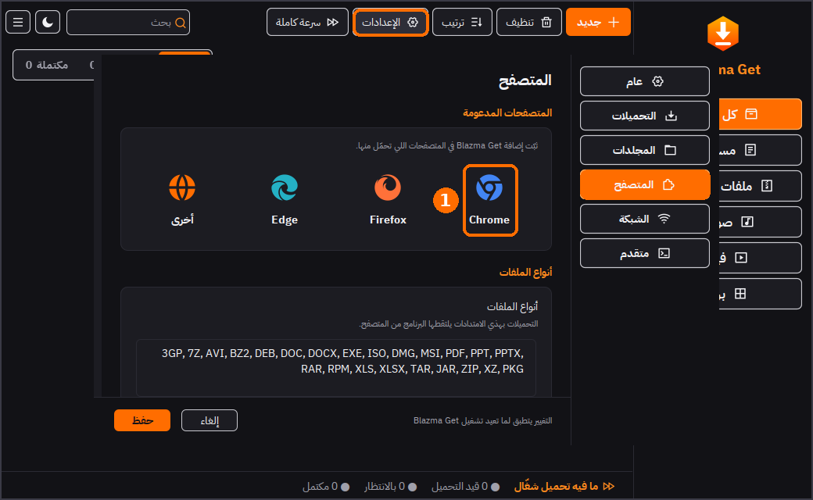</p>

### 2. افتح مجلد الإضافة وانسخ عنوان الصفحة

بتطلع لك نافذة فيها نفس الخطوات:

- **②** اضغط **افتح مجلد الإضافة**: يفتح لك المجلد اللي فيه الإضافة. **لا تحذفه ولا تنقله**، لأن المتصفح يشغّل الإضافة منه.
- **③** اضغط **انسخ عنوان الصفحة**: ينسخ لك عنوان صفحة الإضافات في المتصفح.

<p align="center">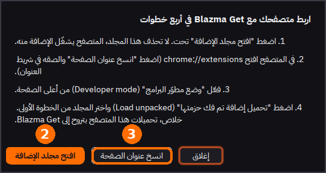</p>

مكان المجلد في ويندوز (تقدر تلصقه في شريط العنوان حق مستكشف الملفات):

```
%USERPROFILE%\.blazma-get\browser-extension\chrome-extension
```

### 3. افتح صفحة الإضافات وفعّل وضع المطوّر

- **③** في المتصفح الصق العنوان في شريط العنوان واضغط Enter:

  | المتصفح | العنوان |
  |---|---|
  | Chrome | `chrome://extensions` |
  | Edge | `edge://extensions` |
  | Brave | `brave://extensions` |
  | Opera | `opera://extensions` |

- **④** فعّل **وضع مطوّر البرامج** (Developer mode). في Chrome تلقاه أعلى الصفحة، وفي Edge تلقاه أسفل القائمة الجانبية.

<p align="center">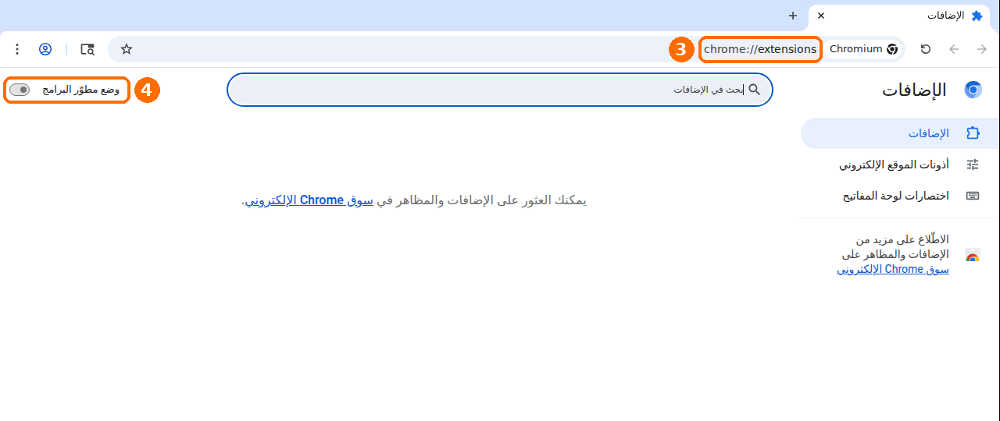</p>

### 4. حمّل الإضافة

- **⑤** بعد ما تفعّل وضع المطوّر يطلع زر **تحميل إضافة تم فك حزمتها** (Load unpacked). اضغطه واختر المجلد اللي فتحته في الخطوة 2.

<p align="center">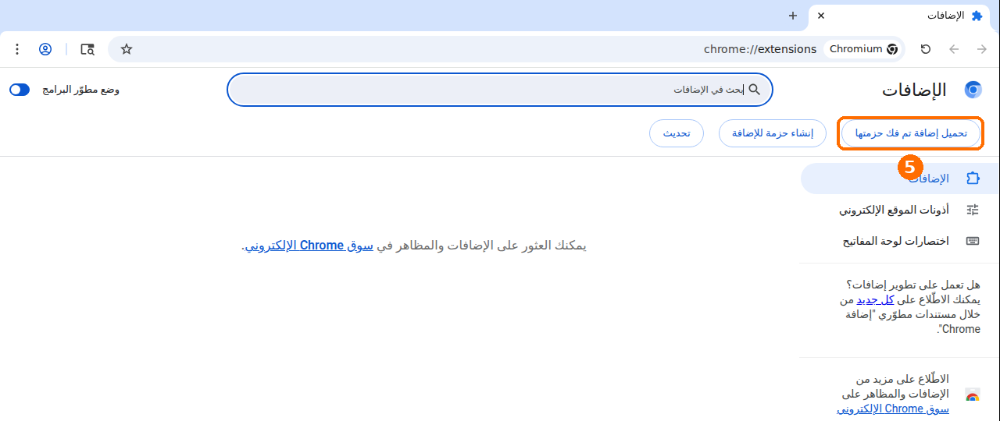</p>

- **⑥** خلاص، بتطلع لك **Blazma Get Browser Helper** في قائمة الإضافات وهي مفعّلة.

<p align="center">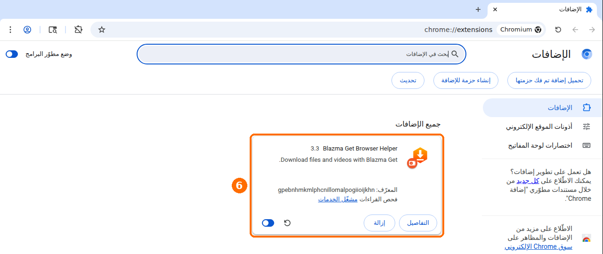</p>

<a id="ar-firefox"></a>

## فايرفوكس

1. في Blazma Get: **الإعدادات ← المتصفح ← Firefox**، واضغط **افتح مجلد الإضافة**.
2. في فايرفوكس افتح `about:debugging#/runtime/this-firefox`
3. اضغط **Load Temporary Add-on** (تحميل إضافة مؤقتة) واختر ملف **`manifest.json`** من المجلد.

⚠️ فايرفوكس يشيل الإضافات المؤقتة لما تسكّره، فتحتاج تعيد الخطوة 2 و3 كل ما تفتحه من جديد. هذا بيتحل لما ننشر الإضافة في متجر فايرفوكس.

<a id="ar-test"></a>

## جرّب إنها تشتغل

خلّ Blazma Get شغّال (يكفي يكون مصغّر جنب الساعة)، وحمّل أي ملف من المتصفح (مثلًا ملف zip أو exe). بدل ما يحمّله المتصفح، بتطلع لك نافذة Blazma Get فيها اسم الملف وحجمه، اضغط **تحميل**.

<p align="center">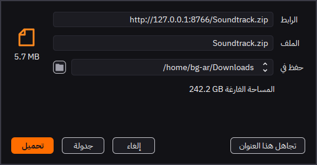</p>

<a id="ar-help"></a>

## لو ما اشتغلت

| المشكلة | الحل |
|---|---|
| المتصفح يحمّل الملف بنفسه | تأكد إن Blazma Get **شغّال**. الإضافة ترسل التحميل للبرنامج، ولو البرنامج مسكّر يحمّله المتصفح عادي. لو ضغطت أيقونة الإضافة وطلع لك *Unable to connect with Blazma Get* فمعناه البرنامج مو شغّال |
| نوع ملف معيّن ما ينلقط | من **الإعدادات ← المتصفح ← أنواع الملفات** أضف امتداده (مثل `APK`) |
| الإضافة مطفية | في صفحة الإضافات تأكد إن مفتاح Blazma Get Browser Helper شغّال. واضغط على أيقونة الإضافة في المتصفح وتأكد إن **Browser monitoring** مفعّل |
| الإضافة اختفت أو طلع خطأ | غالبًا المجلد انحذف أو انتقل. من Blazma Get اضغط **افتح مجلد الإضافة** مرة ثانية، واحذف الإضافة من المتصفح وحمّلها من جديد |
| حدّثت Blazma Get | اضغط **افتح مجلد الإضافة** مرة وحدة (يحدّث ملفات الإضافة)، وبعدين اضغط زر التحديث ↻ على الإضافة في صفحة الإضافات |
| نزّلت `BlazmaGet-Chrome-Extension.zip` من صفحة الإصدار | فك الضغط في مجلد ثابت ما راح تحذفه، وبعدين كمّل من الخطوة 3 واختر هذا المجلد |

</div>

---

<a id="english"></a>

# 🧩 Installing the browser extension

The extension sends every file you download in your browser to **Blazma Get** instead of the browser's own downloader, and picks up videos on web pages. It **ships inside Blazma Get**, so there is nothing else to download.

> The extension is not on the Chrome Web Store yet, so it is installed by hand. It takes about a minute and you only do it once.

**Contents:** [Chrome, Edge, Brave](#en-chrome) · [Firefox](#en-firefox) · [Check that it works](#en-test) · [Troubleshooting](#en-help)

<a id="en-chrome"></a>

## Chrome, Edge, Brave and Opera

### 1. Open the Browser page in Blazma Get

Click **Settings** at the top, then **Browser** in the side menu, and click your browser (Chrome, Edge, or "Other" for Brave and Opera).

<p align="center">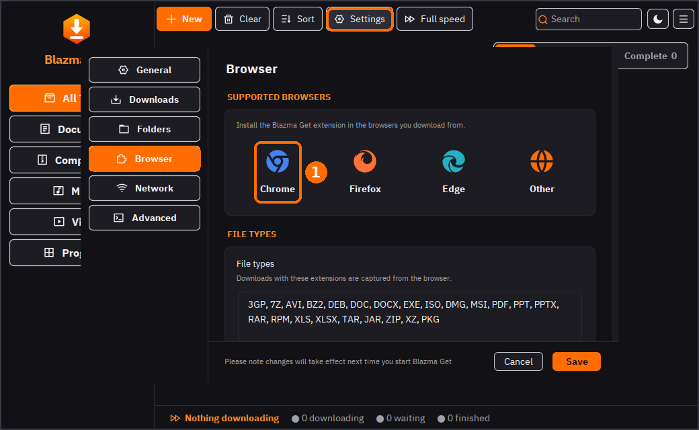 Browser"></p>

### 2. Open the extension folder and copy the page address

A window with the same steps opens:

- **②** Click **Open extension folder**. It opens the folder that holds the extension. **Do not delete or move it**: the browser runs the extension from there.
- **③** Click **Copy page address** to copy the address of the browser's extensions page.

<p align="center">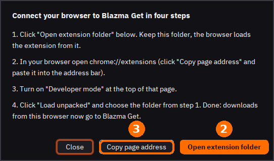</p>

On Windows the folder is (you can paste this into File Explorer's address bar):

```
%USERPROFILE%\.blazma-get\browser-extension\chrome-extension
```

### 3. Open the extensions page and turn on Developer mode

- **③** Paste the address into the browser's address bar and press Enter:

  | Browser | Address |
  |---|---|
  | Chrome | `chrome://extensions` |
  | Edge | `edge://extensions` |
  | Brave | `brave://extensions` |
  | Opera | `opera://extensions` |

- **④** Turn on **Developer mode**: at the top of the page in Chrome, in the left side panel in Edge.

<p align="center">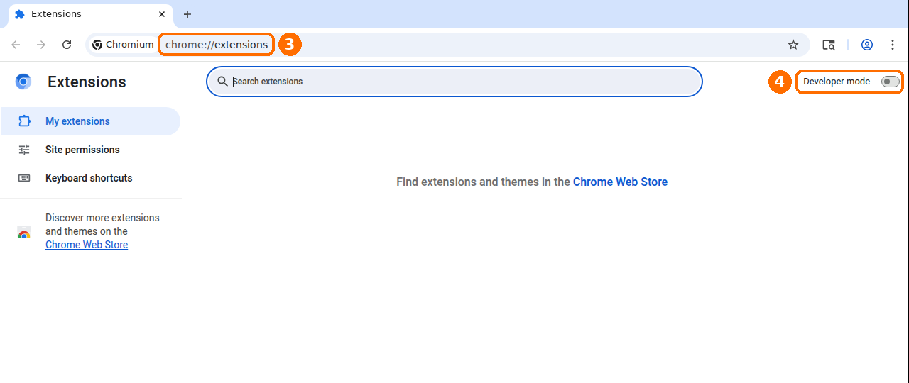</p>

### 4. Load the extension

- **⑤** A **Load unpacked** button appears. Click it and choose the folder from step 2.

<p align="center">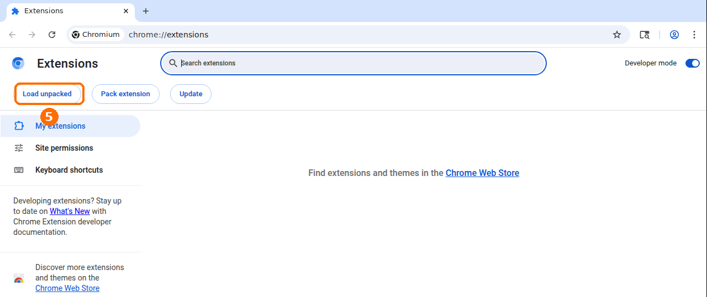</p>

- **⑥** Done: **Blazma Get Browser Helper** shows up in the list, turned on.

<p align="center">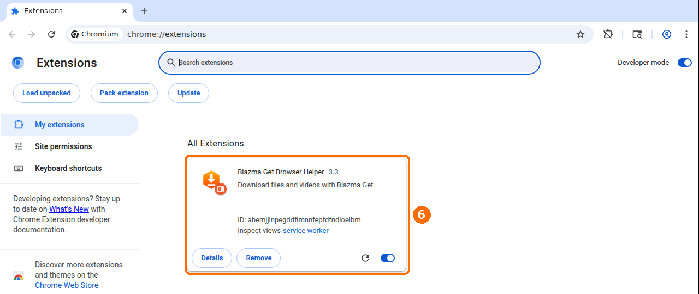</p>

<a id="en-firefox"></a>

## Firefox

1. In Blazma Get: **Settings > Browser > Firefox**, then click **Open extension folder**.
2. In Firefox open `about:debugging#/runtime/this-firefox`
3. Click **Load Temporary Add-on** and choose the **`manifest.json`** file in that folder.

⚠️ Firefox removes temporary add-ons when it closes, so repeat steps 2 and 3 after restarting it. This goes away once the extension is published on Firefox Add-ons.

<a id="en-test"></a>

## Check that it works

Keep Blazma Get running (minimized to the tray is fine) and download any file in the browser, for example a zip or an exe. Instead of the browser downloading it, the Blazma Get window opens with the file name and size: click **Download**.

<p align="center">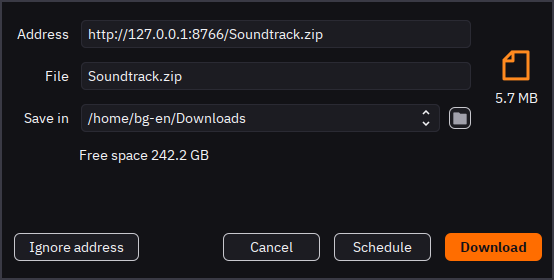</p>

<a id="en-help"></a>

## Troubleshooting

| Problem | Fix |
|---|---|
| The browser downloads the file itself | Make sure Blazma Get is **running**. The extension hands downloads to the app; when the app is closed, the browser downloads as usual. If clicking the extension's icon shows *Unable to connect with Blazma Get*, the app is not running |
| A file type is not caught | Add its extension (e.g. `APK`) in **Settings > Browser > File types** |
| The extension is off | On the extensions page, check that Blazma Get Browser Helper is switched on. Click the extension's icon in the toolbar and make sure **Browser monitoring** is ticked |
| The extension disappeared or shows an error | The folder was probably deleted or moved. Click **Open extension folder** in Blazma Get again, remove the extension from the browser and load it again |
| You updated Blazma Get | Click **Open extension folder** once (it refreshes the extension files), then click the reload button ↻ on the extension's card |
| You downloaded `BlazmaGet-Chrome-Extension.zip` from the release page | Unzip it into a folder you will keep, then continue from step 3 and choose that folder |
